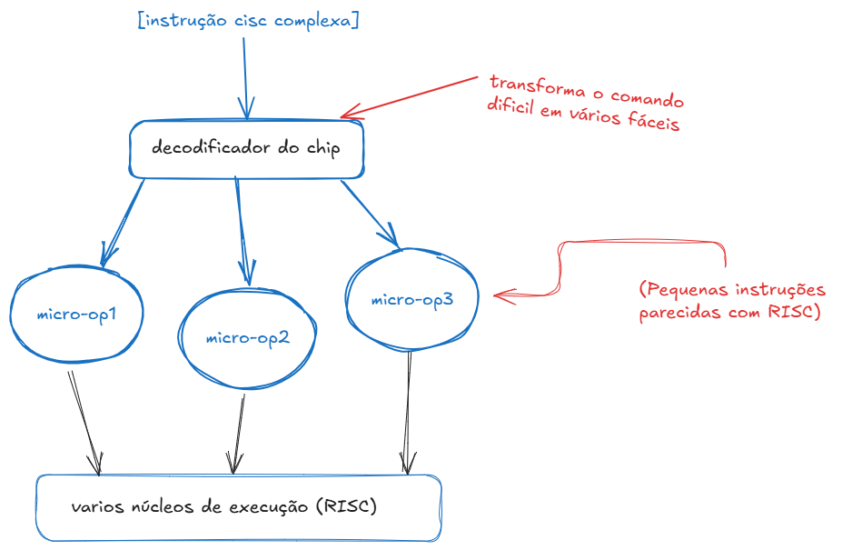
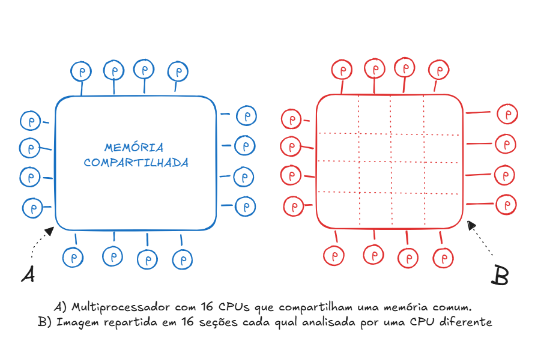
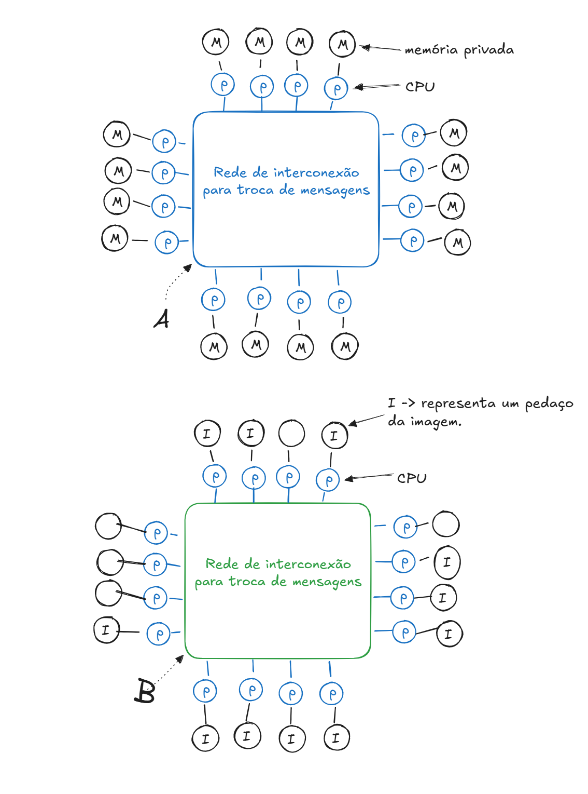

# Arquiteturas paralelas e arquiteturas avançadas

Para entender o paralelismo (fazer várias coisas ao mesmo tempo), precisamos ver como RISC e CISC lidam com as tarefas. Imagine uma linha de produção de uma fábrica de carros.
## O Conceito de Pipeline (Linha de Produção)
O segredo do paralelismo moderno começou com o Pipeline. Em vez de esperar um carro ficar totalmente pronto para começar o próximo, a fábrica divide o trabalho em etapas:

   1. Montar o chassi.
   2. Colocar o motor.
   3. Pintar.

Se cada etapa leva 1 minuto, depois que a linha enche, um carro fica pronto a cada 1 minuto, e não a cada 3 minutos. Três carros estão sendo processados ao mesmo tempo em etapas diferentes. Isso é paralelismo básico a nível de instrução.
------------------------------
## Como o RISC ajuda o Paralelismo?
O RISC foi feito sob medida para o Pipeline. Como as peças (instruções) são todas do mesmo tamanho e levam o mesmo tempo para serem feitas, a esteira roda em ritmo perfeito, sem paradas.

* Instruções padronizadas: O processador sabe exatamente o tamanho de cada tarefa.
* Ritmo constante: Quase toda instrução avança uma etapa por batida do relógio (clock).
* Fluxo perfeito: É muito fácil colocar várias instruções na esteira ao mesmo tempo.

------------------------------
## O Problema do CISC com o Pipeline puro
No CISC tradicional, as instruções têm tamanhos e tempos muito diferentes. Uma instrução pode ser "trocar o pneu" (rápido) e a próxima pode ser "construir o motor inteiro" (muito lento).

* Entupimento da esteira: Se a tarefa do motor demora, a esteira inteira para.
* Complexidade: As outras tarefas atrás na linha de produção ficam esperando, quebrando o paralelismo.

------------------------------
## A Solução Moderna: A Fusão das Duas
O como você é iniciante, aqui vai o maior segredo dos computadores atuais (como o seu Intel ou AMD): eles usam as duas arquiteturas juntas para alcançar o paralelismo máximo.

Os processadores modernos são CISC por fora e RISC por dentro. Eles recebem o código compacto do CISC, quebram esse código em mini-instruções simples (chamadas micro-ops, idênticas ao RISC) e jogam essas mini-instruções em várias esteiras paralelas.

## Multprocessadores x Multicomputadores

A diferença fundamental entre os dois é a presença ou a ausência de memória compartilhada. Essa diferença interfere no modo como são projetados, contruídos e programados, bem como em sua escala de produção e preço.

### Multiprocesadores

Um computador paralelo cujas CPUs compartilham uma memória comum é denominado __multiprocessadores__

>[!NOTE]
> A capacidade de dois (ou mais) processos comunicarem-se apenas lendo a escrevendo na memória é o principal motivo de os multiprocessadores serem populares. É m modelo fácil de entender para os programadores e é aplicavel a inúmeros problemas. 

### Multicomputadores

Nos multicomputadores, cada CPU tem sua própria memória privada, acessivel somente à própria CPU. Esse projeto, denominado tambem sitema de memória distribuida, é ilustado na figura 4.14(a).

(a) Multicomputador com 16 CPUs, cada uma com sua própria memória privada, (b) Imagem de mapa de bits da figura 4.13 dividida entre as 16 memórias. 
